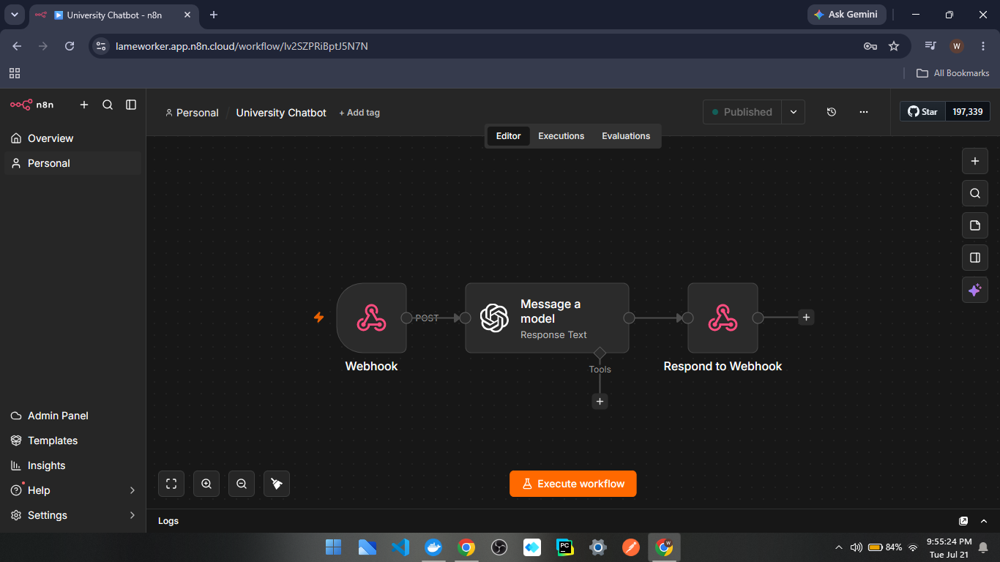

# High-Efficiency College Admissions AI Chatbot (Database-Free)

A production-ready, low-latency AI chatbot workflow built using **n8n** and **OpenAI**. This project completely bypasses the infrastructure overhead of traditional RAG (Retrieval-Augmented Generation) or SQL setups by utilizing **Static Knowledge Injection**. 

The result is an incredibly fast, highly cost-optimized assistant that delivers 100% accurate responses grounded strictly in curated campus data.

---
## 🛠️ System Architecture Diagram

---
## 🚀 How It Works

Instead of dynamically querying a database on every user message, this workflow leverages the massive context windows of modern LLMs:

1. **Context Curation:** A complete structural snapshot of the college website (including admission criteria, course catalogs, and instructor profiles) was scraped and condensed into a master summary using Claude.
2. **Static Injection:** This structured knowledge corpus is hardcoded directly into the `System Prompt` of the OpenAI node within n8n.
3. **Orchestration:** The n8n workflow manages the incoming payloads, maintains conversation memory across turns, and handles clean user input/output routing.

---

## 🛠️ Tech Stack

*   **Workflow Engine:** n8n (Self-hosted / Cloud)
*   **LLM Core:** OpenAI (GPT-4o / GPT-4o-mini)
*   **Context Engineering:** Anthropic Claude (for initial website scraping and master data synthesis)

---

## 📊 Key Architectural Advantages

*   **Zero Database Latency:** Eliminating SQL or Vector DB lookups drops response latency significantly, creating a snappy user experience.
*   **Hallucination-Free:** By grounding the LLM strictly within the injected prompt boundary, the agent cannot fabricate critical admissions requirements or deadlines.
*   **Cost-Optimized:** Because the master knowledge prompt remains stable across chats, it takes full advantage of modern API **Prompt Caching**, cutting operational token costs drastically.

---

## 📦 Deployment Guide

To import and run this workflow in your own environment:

1. Create a new, blank workflow in your **n8n** canvas.
2. Copy the entire contents of the `workflow.json` file from this repository.
3. Click inside your n8n canvas and press `Ctrl + V` (or `Cmd + V` on Mac) to paste the nodes instantly.
4. Open the OpenAI node and link your OpenAI API credentials.
5. Open the main system prompt node and replace the text inside with your own curated website or business data summary.
6. Toggle the workflow to **Active**!
7. go to tiiny.host website and upload the ai-chatbot-widget.html on it, after that the html page will be live for demo.
8. Copy or open the URL given by tinny.host website and test the chatbot.

---

## 📄 License

Distributed under the MIT License. See `LICENSE` for more information.
